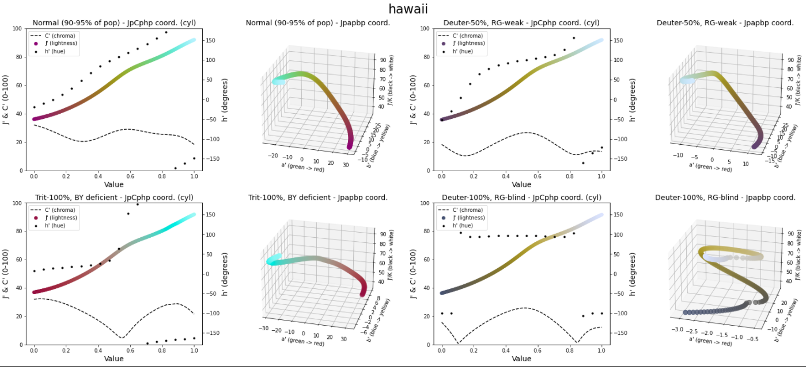
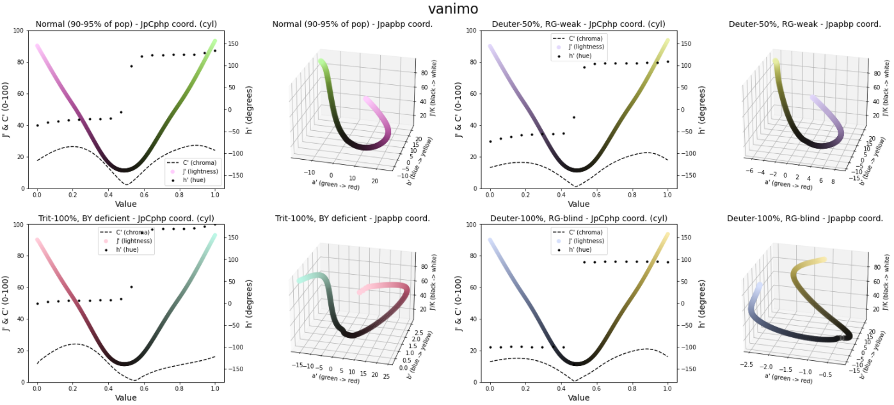
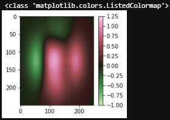

[buy me caffeine](https://ko-fi.com/V7V72SOHX)


# Scientific color maps 

## Blog post

[Scicomap Medium blog post (free)](https://towardsdatascience.com/your-colour-map-is-bad-heres-how-to-fix-it-lessons-learnt-from-the-event-horizon-telescope-b82523f09469)

## Installation

```shell
pip install scicomap
```

## Introduction 

Scicomap is a package that provides scientific color maps and tools to standardize your favourite color maps if you don't like the built-in ones.
Scicomap currently provides sequential, bi-sequential, diverging, circular, qualitative and miscellaneous color maps. You can easily draw examples, compare the rendering, see how colorblind people will perceive the color maps. I will illustrate the scicomap capabilities below.

This package is heavily based on the [Event Horyzon Plot package](https://github.com/liamedeiros/ehtplot/tree/docs) and uses good color maps found in the [the python portage of the Fabio Crameri](https://github.com/callumrollo/cmcrameri), [cmasher](https://cmasher.readthedocs.io/), [palettable](https://jiffyclub.github.io/palettable/), [colorcet](https://colorcet.holoviz.org/) and [cmocean](https://matplotlib.org/cmocean/)

## Motivation

The accurate representation of data is essential. Many common color maps distort data through uneven colour gradients and are often unreadable to those with color-vision deficiency. An infamous example is the jet color map. These color maps do not render all the information you want to illustrate or even worse render false information through artefacts. Scientist or not, your goal is to communicate visual information in the most accurate and appealing fashion. Moreover, do not overlook colour-vision deficiency, which represents 8% of the (Caucasian) male population.

## Color spaces

Perceptual uniformity is the idea that Euclidean distance between colors in color space should match human color perception distance judgements. For example, a blue and red that are at a distance d apart should look as discriminable as green and purple that are at a distance d apart.
Scicomap uses the CAM02-UCS color space (Uniform Colour Space). Its three coordinates are usually denoted by J', a', and b'. And its cylindrical coordinates are J', C', and h'. The perceptual color space Jab is similar to Lab. However, Jab uses an updated color appearance model that in theory provides greater precision for discriminability measurements.

 * Lightness: also known as value or tone, is a representation of a color's brightness
 * Chroma: the intrinsic difference between a color and gray of an object
 * Hue: the degree to which a stimulus can be described as similar to or different from stimuli that are described as red, green, blue, and yellow

## Encoding information

 * Lightness J': for a scalar value, intensity. It must vary linearly with the physical quantity
 * hue h' can encode an additional physical quantity, the change of hue should be linearly proportional to the quantity. The hue h' is also ideal in making an image more attractive without interfering with the representation of pixel values.
 * chroma is less recognizable and should not be used to encode physical information
  
## Color map uniformization

Following the references and the theories, the uniformization is performed by

 * Making the color map linear in J'
 * Lifting the color map (making it lighter, i.e. increasing the minimal value of J')
 * Symmetrizing the chroma to avoid further artefacts
 * Avoid kinks and edges in the chroma curve
 * Bitonic symmetrization or not


# Scicomap

## Choosing the right type of color maps
Scicomap provides a bunch of color maps for different applications. The different types of color map are 

```python
import scicomap as sc
sc_map = sc.SciCoMap()
sc_map.get_ctype()
```

```
dict_keys(['diverging', 'sequential', 'multi-sequential', 'circular', 'miscellaneous', 'qualitative'])
```

I'll refer to the [The misuse of colour in science communication](https://www.nature.com/articles/s41467-020-19160-7.pdf) for choosing the right scientific color map

<td align="left"></td>

## Get the matplotlib cmap


```python
plt_cmap_obj = sc_map.get_mpl_color_map()
```

## Choosing the color map for a given type

Get the color maps for a given type

```python
sc_map = sc.ScicoSequential()
sc_map.get_color_map_names()
```

```
dict_keys(['afmhot', 'amber', 'amber_r', 'amp', 'apple', 'apple_r', 'autumn', 'batlow', 'bilbao', 'bilbao_r', 'binary', 'Blues', 'bone', 'BuGn', 'BuPu', 'chroma', 'chroma_r', 'cividis', 'cool', 'copper', 'cosmic', 'cosmic_r', 'deep', 'dense', 'dusk', 'dusk_r', 'eclipse', 'eclipse_r', 'ember', 'ember_r', 'fall', 'fall_r', 'gem', 'gem_r', 'gist_gray', 'gist_heat', 'gist_yarg', 'GnBu', 'Greens', 'gray', 'Greys', 'haline', 'hawaii', 'hawaii_r', 'heat', 'heat_r', 'hot', 'ice', 'inferno', 'imola', 'imola_r', 'lapaz', 'lapaz_r', 'magma', 'matter', 'neon', 'neon_r', 'neutral', 'neutral_r', 'nuuk', 'nuuk_r', 'ocean', 'ocean_r', 'OrRd', 'Oranges', 'pink', 'plasma', 'PuBu', 'PuBuGn', 'PuRd', 'Purples', 'rain', 'rainbow', 'rainbow-sc', 'rainbow-sc_r', 'rainforest', 'rainforest_r', 'RdPu', 'Reds', 'savanna', 'savanna_r', 'sepia', 'sepia_r', 'speed', 'solar', 'spring', 'summer', 'tempo', 'thermal', 'thermal_r', 'thermal-2', 'tokyo', 'tokyo_r', 'tropical', 'tropical_r', 'turbid', 'turku', 'turku_r', 'viridis', 'winter', 'Wistia', 'YlGn', 'YlGnBu', 'YlOrBr', 'YlOrRd'])
```

## Use a custom color map

As long as the color map is a `matplotlib.colors.Colormap`, `matplotlib.colors.LinearSegmentedColormap` or `matplotlib.colors.ListedColormap` object, you can pass it in the different classes.

```python
import scicomap as sc
import matplotlib.pyplot as plt

# the thing that should not be
ugly_jet = plt.get_cmap("jet")
sc_map =  sc.ScicoMiscellaneous(cmap=ugly_jet)
f=sc_map.assess_cmap(figsize=(22,10))
```

## Assessing a color map

In order to assess if a color map should be corrected or not, `scicomap` provides a way to quickly check if the lightness is linear, how asymmetric and smooth is the chroma and how the color map renders for color-deficient users. I will illustrate some of the artefacts using classical images, as the pyramid and specific functions for each kind of color map.


### An infamous example

```python
import scicomap as sc
import matplotlib.pyplot as plt

# the thing that should not be
ugly_jet = plt.get_cmap("jet")
sc_map =  sc.ScicoMiscellaneous(cmap=ugly_jet)
f=sc_map.assess_cmap(figsize=(22,10))
```


<td align="left"></td>
 

Clearly, the lightness is not linear, has edges and kinks. The chroma is not smooth and asymmetrical. See the below illustration to see how bad and how many artefacts the jet color map introduces


<td align="left"></td>


## Correcting a color map

### Sequential color map

Let's assess the built-in color map `hawaii` without correction:

```python
sc_map = sc.ScicoSequential(cmap='hawaii')
f=sc_map.assess_cmap(figsize=(22,10))
```

<td align="left"></td>


The color map seems ok, however, the lightness is not linear and the chroma is asymmetrical even if smooth. Those small defects introduce artefact in the information rendering, as we can visualize using the following example


```python
f=sc_map.draw_example()
```

<td align="left"></td>


We can clearly see the artefacts, especially for the pyramid for which our eyes should only pick out the corners in the pyramid (ideal situation). Those artefacts are even more striking for color-deficient users (this might not always be the case). Hopefully, `scicomap` provides an easy way to correct those defects:

```python
# fixing the color map, using the same minimal lightness (lift=None), 
# not normalizing to bitone and 
# smoothing the chroma
sc_map.unif_sym_cmap(lift=None, 
                     bitonic=False, 
                     diffuse=True)

# re-assess the color map after fixing it                     
f=sc_map.assess_cmap(figsize=(22,10))
```

<td align="left"></td>


After fixing the color map, the artefacts are less present

<td align="left"></td>

Get the color map object

```python
plt_cmap_obj = sc_map.get_mpl_color_map()
```

### Diverging color map

We can perform exactly the same fix for diverging, circular, miscellaneous and qualitative color maps. Let's take a diverging color map as an illustrative example:

```python
div_map = sc.ScicoDiverging(cmap='vanimo')
f=div_map.assess_cmap(figsize=(22,10))
```

the original color map is as follows

<td align="left"></td>

which renders as

<td align="left"></td>


The larger dark transition might help to distinguish the positive and negative regions but introduces artefacts (pyramids, second column panels).
By correcting the color map, we remove the smooth dark transition by a sharp one and we "lift" the dark part to make it a bit brighter. Human eyes are more able to differentiate the lighter colors.

```python 
div_map = sc.ScicoDiverging(cmap='vanimo')
div_map.unif_sym_cmap(lift=25, 
                      bitonic=False, 
                      diffuse=True)
f=div_map.assess_cmap(figsize=(22,10))
```


<td align="left"></td>


which render as 


<td align="left"></td>


# Use with matplotlib

## Use a corrected colormap in a matplotlib figure

```python
import matplotlib.pyplot as plt
import matplotlib as mpl
import scicomap as sc
from scicomap.utils import _fn_with_roots

# load the color map
div_map = sc.ScicoDiverging(cmap='watermelon')

# correct the colormap
div_map.unif_sym_cmap(lift=15, 
                      bitonic=False, 
                      diffuse=True)

# get the fixed color map
fixed_cmap = div_map.get_mpl_color_map()
print(type(fixed_cmap))

# use it as you like
im = _fn_with_roots()
norm = mpl.colors.CenteredNorm()
divnorm = mpl.colors.TwoSlopeNorm(vmin=-1, vcenter=0, vmax=1.25)
fig = plt.figure(figsize=(3,3), facecolor="white")
ax = fig.add_subplot(1, 1, 1, facecolor="white")
pos = ax.imshow(im, cmap=fixed_cmap, aspect="auto", norm=divnorm)
fig.colorbar(pos, ax=ax);
```
<td align="left"></td>

## Correct a matplotlib colormap


```python
import matplotlib.pyplot as plt
import matplotlib as mpl
import scicomap as sc
from scicomap.utils import _fn_with_roots

# load the color map
mpl_cmap_obj = plt.get_cmap("PRGn")
div_map = sc.ScicoDiverging(cmap=mpl_cmap_obj)

# correct the colormap
div_map.unif_sym_cmap(lift=None, 
                      bitonic=False, 
                      diffuse=True)

# get the fixed color map
fixed_cmap = div_map.get_mpl_color_map()
print(type(fixed_cmap))

# use it as you like
im = _fn_with_roots()
norm = mpl.colors.CenteredNorm()
divnorm = mpl.colors.TwoSlopeNorm(vmin=-1, vcenter=0, vmax=1.25)
fig = plt.figure(figsize=(3,3), facecolor="white")
ax = fig.add_subplot(1, 1, 1, facecolor="white")
pos = ax.imshow(im, cmap=fixed_cmap, aspect="auto", norm=divnorm)
fig.colorbar(pos, ax=ax);
```

<td align="left"></td>

# Comparing color maps

You can easily compare, raw or corrected, color maps using a picture of your choice

## Color-defiency rendering

Bearing in mind that +- 8% of males are color-deficient, you can visualize the rendering of any colormap for different kind of deficiencies.

```python
c_l =  ["cividis", "inferno", "magma", "plasma", "viridis"]
f = sc.plot_colorblind_vision(ctype='sequential', 
                              cmap_list=c_l, 
                              figsize=(30, 4), 
                              n_colors=11, 
                              facecolor="black")
```

<td align="left"></td>

## Sequential color maps

The built-in picture is coming from [First M87 Event Horizon Telescope Results. IV.
Imaging the Central Supermassive Black Hole](https://arxiv.org/ftp/arxiv/papers/1906/1906.11241.pdf) as the main part of Scicomap is built upon the EHT visualization library.

```python
f = sc.compare_cmap(image="grmhd", 
                    ctype='sequential', 
                    ncols=15, 
                    uniformize=True, 
                    symmetrize=True, 
                    unif_kwargs={'lift': 20}, 
                    sym_kwargs={'bitonic': False, 'diffuse': True})
```

returning

<td align="left"></td>

## Diverging color maps

Comparing the diverging color maps using a vortex image

```python
f = sc.compare_cmap(image="vortex", 
                    ctype='diverging', 
                    ncols=15, 
                    uniformize=True, 
                    symmetrize=True, 
                    unif_kwargs={'lift': None}, 
                    sym_kwargs={'bitonic': False, 'diffuse': True})
```

<td align="left"></td>

## Circular color maps

Comparing circular/phase color maps using a complex function

```python
f = sc.compare_cmap(image="phase", 
                    ctype='circular', 
                    ncols=15, 
                    uniformize=True, 
                    symmetrize=True, 
                    unif_kwargs={'lift': None}, 
                    sym_kwargs={'bitonic': False, 'diffuse': True})
```
<td align="left"></td>

# All the built-in color maps

## Sequential


```python
sc.plot_colormap(ctype='sequential', 
                 cmap_list='all', 
                 figsize=None, 
                 n_colors=5, 
                 facecolor="black", 
                 uniformize=True, 
                 symmetrize=False, 
                 unif_kwargs=None, 
                 sym_kwargs=None)
```
<td align="left"></td>

## Diverging


<td align="left"></td>

## Mutli-sequential

<td align="left"></td>

## Miscellaneous

<td align="left"></td>

## Circular

<td align="left"></td>

## Qualitative

```python
sc.plot_colormap(ctype='qualitative', 
                 cmap_list='all', 
                 figsize=None, 
                 n_colors=5, 
                 facecolor="black", 
                 uniformize=False, 
                 symmetrize=False, 
                 unif_kwargs=None, 
                 sym_kwargs=None)
```

<td align="left"></td>

# References

 * [The misuse of colour in science communication](https://www.nature.com/articles/s41467-020-19160-7.pdf)
 * [Why We Use Bad Color Maps and What You Can Do About It](https://www.kennethmoreland.com/color-advice/BadColorMaps.pdf)
 * [THE RAINBOW IS DEAD…LONG LIVE THE RAINBOW! – SERIES OUTLINE](https://mycarta.wordpress.com/2012/05/29/the-rainbow-is-dead-long-live-the-rainbow-series-outline/)
 * [Scientific colour maps](https://www.fabiocrameri.ch/colourmaps/)
 * [Picking a colour scale for scientific graphics](https://betterfigures.org/2015/06/23/picking-a-colour-scale-for-scientific-graphics/)
 * [ColorCET](https://colorcet.com/)
 * [Good Colour Maps: How to Design Them](https://arxiv.org/abs/1509.03700)
 * [Perceptually uniform color space for image signals including high dynamic range and wide gamut](https://www.osapublishing.org/oe/fulltext.cfm?uri=oe-25-13-15131&id=368272)


# Changes log

### 0.4

 - Including files in source distributions

### 0.3

 - Add a section "how to use with matplotlib"
 - [Bug] Center diverging color map in examples

### 0.2

 - [Bug] Fix typo in chart titles

### 0.1

 - First version
