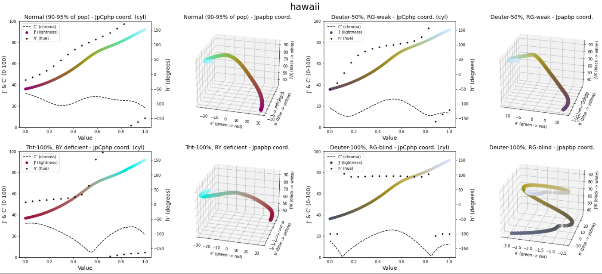

Introduction
============

scicomap helps you build scientific visualizations with perceptually safer
colormaps.

Many default colormaps can create false boundaries and hide important structure.
The problem gets worse for readers with color-vision deficiency. scicomap gives
you tools to inspect these issues and correct them.

Choose by data semantics
------------------------

.. figure:: pics/choosing-cmap.png
   :width: 62%
   :alt: Diagram explaining when to choose sequential, diverging, circular, or qualitative colormaps.

   Choosing the right colormap family is the first high-impact decision.

Why jet/rainbow is problematic
------------------------------

.. figure:: pics/jet.png
   :width: 72%
   :alt: Assessment panel showing jet has non-uniform lightness and chroma artifacts.

   Jet is not perceptually uniform and tends to amplify false visual structure.

.. figure:: pics/jet2.png
   :width: 72%
   :alt: Comparison showing staircase artifacts created by jet.

   Artifact-heavy rendering can add boundaries that are not present in data.

Color-vision accessibility
--------------------------

.. figure:: pics/color-def.png
   :width: 70%
   :alt: Color-vision deficiency illustration.

   Around 8% of Caucasian male readers are affected by color-vision
   deficiencies, so accessibility checks are essential for trustworthy figures.

Perceptual uniformity in practice
---------------------------------

   Baseline colormap assessment before correction.

.. figure:: pics/hawaii-fixed.png
   :width: 72%
   :alt: Corrected hawaii colormap after uniformization.

   After uniformization, lightness and chroma behavior are typically smoother
   and less artifact-prone.

What you can do with scicomap
-----------------------------

- Browse colormaps by purpose (sequential, diverging, circular, qualitative).
- Assess lightness, chroma symmetry, and colorblind accessibility.
- Uniformize and symmetrize existing colormaps.
- Generate examples that make artifacts easy to spot.

Who this project is for
-----------------------

- Researchers and engineers preparing figures for publications.
- Data scientists building dashboards where color meaning must stay clear.
- Anyone who needs better colormap defaults in Matplotlib workflows.

Next step
---------

Go to :doc:`getting-started` for a copy-paste quickstart.

For guided examples
-------------------

- Narrative walkthrough: :doc:`notebooks/tutorial`
- Interactive playground: :doc:`tutorial-marimo`
