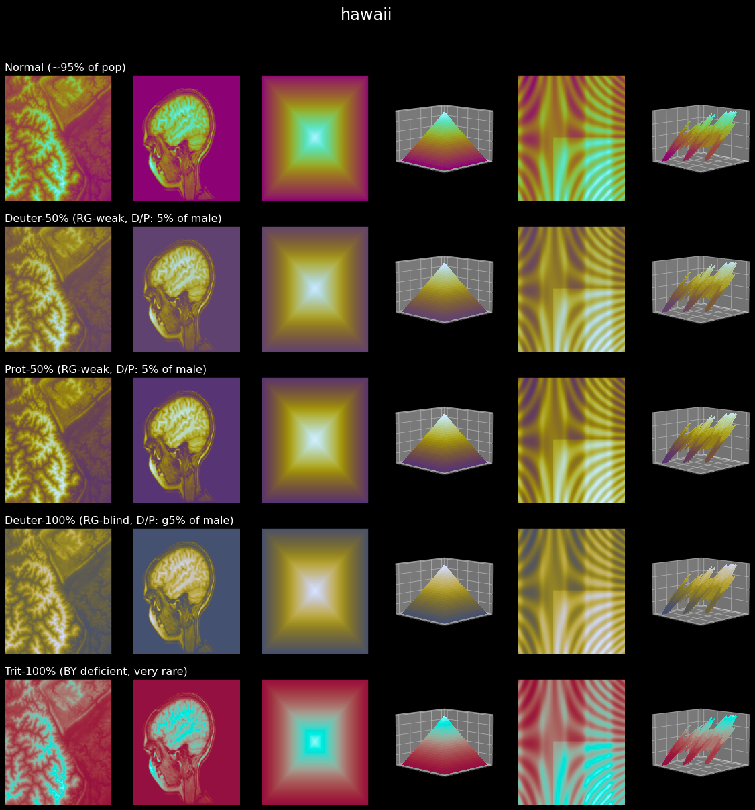
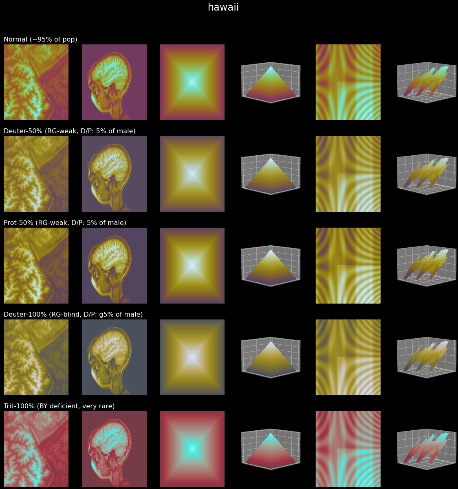

CLI Reference
=============

Use these commands for the most common scicomap workflows.

Quick command map
-----------------

.. list-table::
   :header-rows: 1
   :widths: 24 44 32

   * - Command
     - Purpose
     - Example
   * - ``scicomap list``
     - List colormap families or family-specific names.
     - ``scicomap list sequential``
   * - ``scicomap check``
     - Diagnose one colormap and return status/reasons.
     - ``scicomap check hawaii --type sequential``
   * - ``scicomap preview``
     - Render a visual assessment panel.
     - ``scicomap preview hawaii --type sequential --out hawaii.png``
   * - ``scicomap compare``
     - Compare multiple colormaps on one image.
     - ``scicomap compare hawaii viridis --type sequential --image scan --out compare.png``
   * - ``scicomap fix``
     - Uniformize/symmetrize and preview a colormap.
     - ``scicomap fix hawaii --type sequential --out hawaii-fixed.png``
   * - ``scicomap cvd``
     - Generate color-vision-deficiency preview.
     - ``scicomap cvd hawaii --type sequential --out hawaii-cvd.png``
   * - ``scicomap apply``
     - Apply a colormap to an image file.
     - ``scicomap apply thermal --type sequential --image input.png --out output.png``
   * - ``scicomap wizard``
     - Guided diagnose/improve/apply workflow.
     - ``scicomap wizard --profile quick-look --type sequential --cmap thermal --no-interactive``
   * - ``scicomap report``
     - One-command report bundle (JSON + images + summary).
     - ``scicomap report --profile publication --cmap hawaii --type sequential``
   * - ``scicomap doctor``
     - Environment and path diagnostics.
     - ``scicomap doctor --json``

Profiles
--------

- ``quick-look``: minimal checks and fast feedback.
- ``publication``: quality-first defaults for final figures.
- ``presentation``: publication defaults with brighter lift bias.
- ``cvd-safe``: accessibility-first defaults.
- ``agent``: deterministic JSON-first behavior.

Output modes
------------

- Use ``--json`` (or ``--format json`` where available) for machine-readable
  output in automation and LLM workflows.

Learn by example
----------------

- Full notebook walkthrough: :doc:`notebooks/tutorial`
- Interactive command-to-figure exploration: :doc:`tutorial-marimo`

Equivalent workflow in Python API
---------------------------------

.. tabs::

   .. tab:: Python API

      .. code-block:: python

         import scicomap as sc

         cmap = sc.ScicoSequential(cmap="hawaii")
         cmap.assess_cmap(figsize=(14, 6))
         cmap.unif_sym_cmap(lift=None, bitonic=False, diffuse=True)
         cmap.assess_cmap(figsize=(14, 6))

   .. tab:: CLI

      .. code-block:: shell

         scicomap check hawaii --type sequential
         scicomap fix hawaii --type sequential --out hawaii-fixed.png

What command outputs look like
------------------------------

   ``check``/``preview``/``compare`` style workflows produce artifact-oriented
   visual diagnostics.

   ``fix`` and ``report`` workflows help produce smoother gradients and clearer
   transitions in real plots.

.. figure:: pics/color-def.png
   :width: 58%
   :alt: Color-vision deficiency concept image.

   ``cvd`` validates how your map is perceived under common color-vision
   deficiency conditions.
