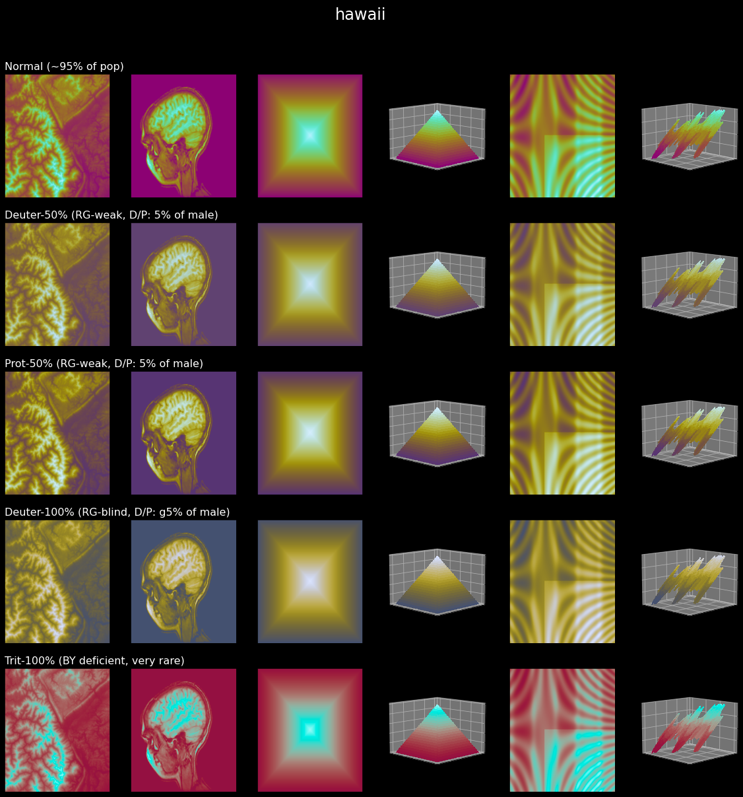
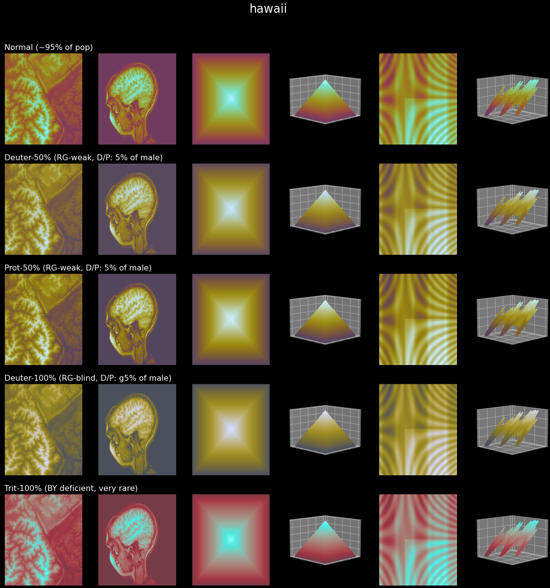
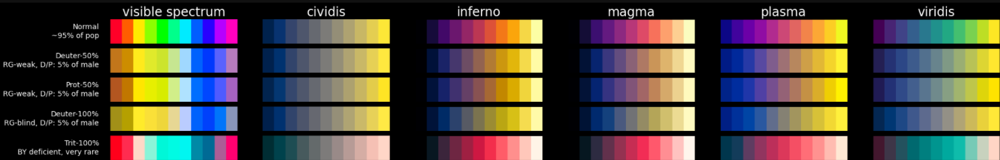

CLI Reference
=============

Use these commands for the most common scicomap workflows.

Quick command map
-----------------

.. list-table::
   :header-rows: 1
   :widths: 24 44 32

   * - Command
     - Purpose
     - Example
   * - ``scicomap list``
     - List colormap families or family-specific names.
     - ``scicomap list sequential``
   * - ``scicomap check``
     - Diagnose one colormap and return status/reasons.
     - ``scicomap check hawaii --type sequential``
   * - ``scicomap preview``
     - Render a visual assessment panel.
     - ``scicomap preview hawaii --type sequential --out hawaii.png``
   * - ``scicomap compare``
     - Compare multiple colormaps on one image.
     - ``scicomap compare hawaii viridis --type sequential --image scan --out compare.png``
   * - ``scicomap fix``
     - Uniformize/symmetrize and preview a colormap.
     - ``scicomap fix hawaii --type sequential --out hawaii-fixed.png``
   * - ``scicomap cvd``
     - Generate color-vision-deficiency preview.
     - ``scicomap cvd hawaii --type sequential --out hawaii-cvd.png``
   * - ``scicomap apply``
     - Apply a colormap to an image file.
     - ``scicomap apply thermal --type sequential --image input.png --out output.png``
   * - ``scicomap wizard``
     - Guided diagnose/improve/apply workflow.
     - ``scicomap wizard --profile quick-look --type sequential --cmap thermal --no-interactive``
   * - ``scicomap report``
     - One-command report bundle (JSON + images + summary).
     - ``scicomap report --profile publication --cmap hawaii --type sequential``
   * - ``scicomap doctor``
     - Environment and path diagnostics.
     - ``scicomap doctor --json``

Image handling
--------------

``apply``, wizard apply workflows, and reports using an image file share the
same conversion modes. ``luminance`` combines RGB channels using weights
0.2126, 0.7152, and 0.0722; ``first-channel`` uses the red channel;
``gray-only`` requires a single-channel image. Scalar values are scaled from
the image minimum and maximum to [0, 1]; constant images use 0.
Input alpha is preserved when saving to a format that supports transparency,
such as PNG. Reports using a builtin image still produce a rendered figure.
Unreadable or malformed images produce an actionable error.

``doctor`` checks directory writability with a temporary file that is removed
after the check, preserving existing files.

Profiles
--------

- ``quick-look``: minimal checks and fast feedback.
- ``publication``: quality-first defaults for final figures.
- ``presentation``: publication defaults with brighter lift bias.
- ``cvd-safe``: CVD simulation defaults; this profile enforces the CVD stage.
- ``agent``: deterministic JSON-first behavior.

Workflow stages and diagnostics
-------------------------------

Wizard and report resolve profile defaults, then run the enabled ``--fix``,
``--cvd``, and ``--apply`` stages. Explicit ``--no-fix`` and ``--no-apply``
disable those stages, including for improve and apply goals. ``--no-cvd``
disables simulation except with the enforcing ``cvd-safe`` profile.
The agent profile applies an image when its resolved goal is ``apply``;
it never prompts. Interactive wizard collects a missing image before validation.

Diagnostics, CVD simulations, and applied images use the corrected map when
fix is enabled, and the original otherwise. Reports retain an original
assessment alongside the corrected assessment and identify the selected map
in ``map_used``. The ``diagnostics`` field describes that selected map;
``original_diagnostics`` describes the original.

Statuses are heuristics, not accessibility certification. Sequential maps are
checked for lightness progression; diverging maps for progression on each
branch toward a central extremum; multi-sequential maps for progression within
each half. Circular maps are checked for an endpoint seam and repeated
lightness oscillations. Unordered qualitative and miscellaneous maps receive
a caution to inspect color distinctions in context, rather than a request to
linearize their lightness. ``monotonic_lightness`` is a measurement of the whole
map, so a false value alone does not indicate a problem for every family.

CVD images simulate selected vision conditions. They do not establish that
colors are distinguishable for every viewer or certify a figure's accessibility.

Output modes
------------

- Use ``--json`` (or ``--format json`` where available) for machine-readable
  output in automation and LLM workflows.

Learn by example
----------------

- Full notebook walkthrough: :doc:`notebooks/tutorial`
- Interactive command-to-figure exploration: :doc:`tutorial-marimo`

Equivalent workflow in Python API
---------------------------------

.. tabs::

   .. tab:: Python API

      .. code-block:: python

         import scicomap as sc

         cmap = sc.ScicoSequential(cmap="hawaii")
         cmap.assess_cmap(figsize=(14, 6))
         cmap.unif_sym_cmap(lift=None, bitonic=False, diffuse=True)
         cmap.assess_cmap(figsize=(14, 6))

   .. tab:: CLI

      .. code-block:: shell

         scicomap check hawaii --type sequential
         scicomap fix hawaii --type sequential --out hawaii-fixed.png

What command outputs look like
------------------------------

   ``check``/``preview``/``compare`` style workflows produce artifact-oriented
   visual diagnostics.

   ``fix`` and ``report`` workflows help produce smoother gradients and clearer
   transitions in real plots.

   ``cvd`` simulates how your map may appear under common color-vision
   deficiency conditions.
