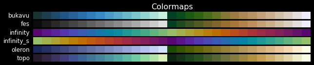
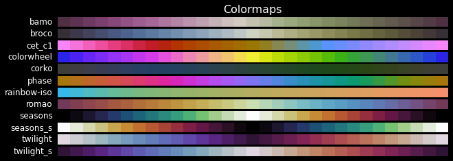

Colormap Gallery
================

Use this gallery to quickly scan colormap families before running detailed
assessment workflows.

Sequential family
-----------------

Best for ordered values with a single direction (low to high).

.. figure:: pics/seq-cmaps-all.png
   :width: 92%
   :alt: Sequential colormap family overview.

Diverging family
----------------

Best for values around a meaningful center (for example anomaly maps).

.. figure:: pics/div-cmaps-all.png
   :width: 92%
   :alt: Diverging colormap family overview.

Multi-sequential family
-----------------------

Useful when multiple ordered bands must remain visually distinct.

Circular family
---------------

Best for periodic variables such as phase and angle.

Qualitative family
------------------

Best for categories without numeric ordering.

.. figure:: pics/qual-cmaps-all.png
   :width: 92%
   :alt: Qualitative colormap family overview.

Miscellaneous family
--------------------

Includes legacy or specialized maps; assess these carefully before publication.

.. figure:: pics/misc-cmaps-all.png
   :width: 92%
   :alt: Miscellaneous colormap family overview.

Next steps
----------

- Validate one candidate with :doc:`user-guide` assessment workflow.
- Compare options using :doc:`cli-reference` commands.
- Follow a complete walkthrough in :doc:`notebooks/tutorial`.
- Explore the reactive tutorial in :doc:`tutorial-marimo`.
