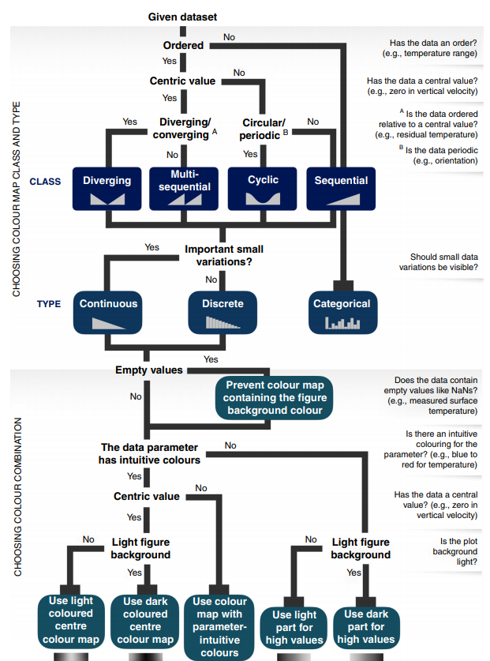
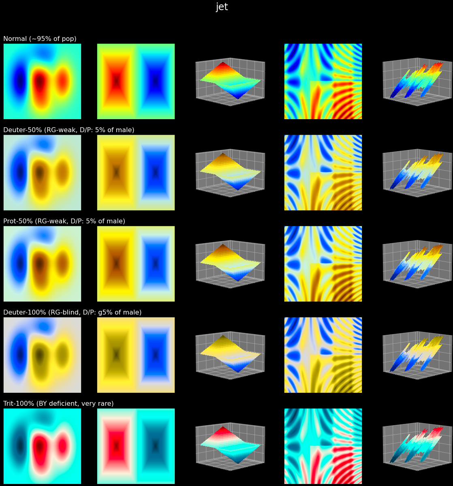

scicomap documentation
======================

scicomap helps you choose, assess, and correct scientific colormaps and preview
selected color-vision deficiency conditions in your figures.

Why this matters
----------------

   Pick a colormap family that matches your data semantics before styling.

   Non-uniform maps such as jet/rainbow can create false boundaries and visual
   artifacts in otherwise smooth fields.

Who this is for
---------------

- Researchers preparing publication figures.
- Data analysts and data scientists building trustworthy dashboards.
- Engineers who need robust colormap defaults in Matplotlib workflows.

Quick start
-----------

Start with :doc:`getting-started` for matching Python and CLI inspection,
correction, and export workflows. Inspection preserves the original map;
correction is an explicit choice.

Choose your path
----------------

- New user: :doc:`getting-started`
- Practical guidance: :doc:`user-guide`
- Full tutorial notebook: :doc:`notebooks/tutorial`
- Interactive playground: :doc:`tutorial-marimo` (`open directly <https://thomasbury.github.io/scicomap/marimo/index.html>`_)
- Visual family browser: :doc:`gallery`
- Full API details: :doc:`api-reference`
- CLI command reference: :doc:`cli-reference`

Common tasks
------------

- Assess a colormap before publication.
- Fix non-uniform lightness and chroma artifacts.
- Inspect color-vision deficiency simulations with your data.
- Apply a colormap to your own image data.

Advanced and automation
-----------------------

- One-command workflow reports with `status`, artifacts, and recommendations:
  ``scicomap report ...``.
- Explicit correction and simulation stages, with prompting only in ``wizard``.
- Machine-friendly docs and JSON outputs for tooling/LLMs:
  :doc:`llm-access`.

Documentation last change: |today|

.. toctree::
   :maxdepth: 2
   :caption: Start Here

   Introduction
   getting-started

.. toctree::
   :maxdepth: 2
   :caption: How-to Guides

   user-guide

.. toctree::
   :maxdepth: 2
   :caption: Tutorials

   notebooks/tutorial.ipynb
   tutorial-marimo
   gallery

.. toctree::
   :maxdepth: 2
   :caption: Reference and Support

   api-reference
   migrating-v2
   cli-reference
   faq
   troubleshooting
   llm-access
   contributing
