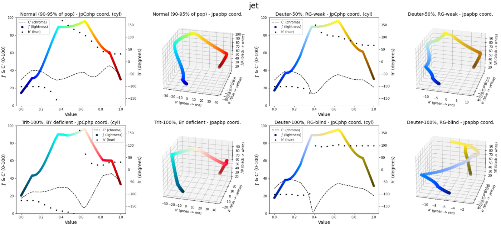
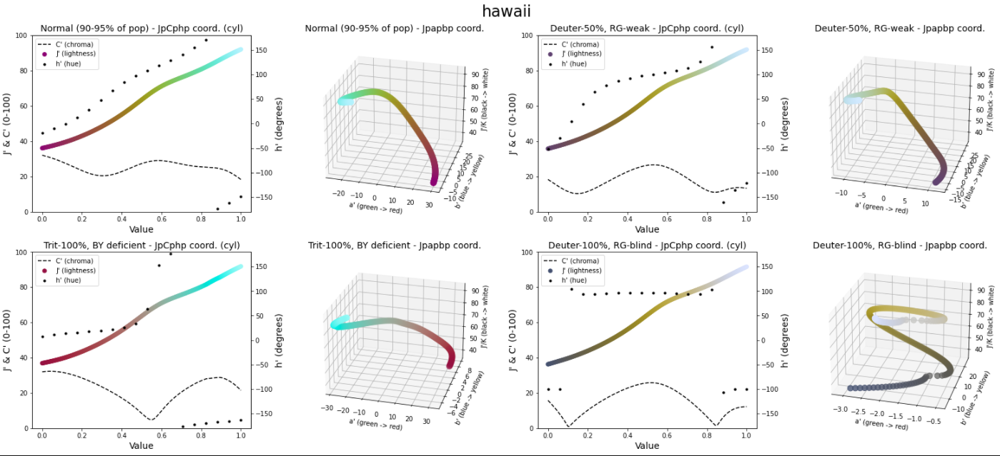
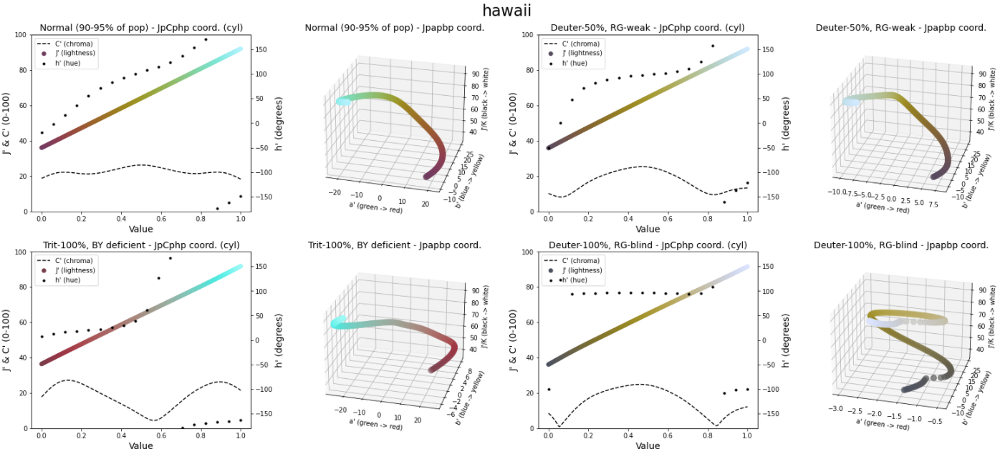

User Guide
==========

Choose the right colormap type
------------------------------

Use sequential colormaps for ordered values, diverging colormaps for values
around a midpoint, and qualitative colormaps for categories.

If your figure shows directional or cyclic variables (phase, angle), use
circular colormaps.

Assess a colormap before using it
---------------------------------

Use ``assess_cmap`` to inspect lightness progression, chroma behavior, and
colorblind rendering.

.. tabs::

   .. tab:: Python API

      .. code-block:: python

         import matplotlib.pyplot as plt
         import scicomap as sc

         jet = plt.get_cmap("jet")
         cmap = sc.ScicoMiscellaneous(cmap=jet)
         cmap.assess_cmap(figsize=(14, 6))

   .. tab:: CLI

      .. code-block:: shell

         scicomap preview rainbow-kov --type miscellaneous --out jet-assess.png

   Jet/rainbow often introduces false contrast and non-linear lightness changes.

Uniformize a colormap
---------------------

When a colormap contains visible artifacts, apply uniformization and reassess.

.. tabs::

   .. tab:: Python API

      .. code-block:: python

         import scicomap as sc

         cmap = sc.ScicoSequential(cmap="hawaii")
         cmap.unif_sym_cmap(lightness_rounding=None, bitonic=False, diffuse=True)
         cmap.assess_cmap(figsize=(14, 6))

   .. tab:: CLI

      .. code-block:: shell

         scicomap fix hawaii --type sequential --out hawaii-fixed.png

   Before correction.

   After correction. Uniformization reduces visible artifacts in practical
   rendering tests.

Practical workflow
------------------

``lightness_rounding`` rounds the lower CAM02-UCS lightness bound up to a multiple of the
given step: ``ceil(Jplower / lightness_rounding) * lightness_rounding``. It is not an additive increase.
``None`` and ``0`` leave that bound unchanged. Uniformization preserves the
sample count and alpha values, including the center of an odd-length
diverging map. If the lightness pattern is unrecognized, the map is returned
unchanged with a warning; inspect the result with ``diagnose_cmap``.

The ``hp`` argument to ``max_chroma`` is a hue angle in radians; one turn is
``2*pi``. The hue axis in assessment plots is displayed in degrees.

1. Start with a colormap family that matches your data semantics.
2. Assess lightness and colorblind behavior.
3. Apply uniformization only when needed.
4. Validate with your real data, not only synthetic examples.

Explicit CLI stages
-------------------

Inspect the original map first. Request a correction with ``--fix`` and a
CVD simulation with ``--cvd``. Apply to an image with ``--apply --image``.
Use ``--json`` and an explicit output directory for automation.

.. code-block:: shell

   scicomap report --cmap hawaii --out reports/hawaii
   scicomap report --cmap thermal --fix --cvd --out reports/thermal --json

Reuse a corrected map
---------------------

``SciCoMap.export_cmap`` writes a JSON file containing ``rgba`` (an N-by-4
sRGB table), ``name``, ``family``, ``scicomap_version``, ``source_rgba``, and
the ordered ``transformations`` with their parameters. The table preserves
sample count and alpha without decimal rounding. Load it with Matplotlib's
``ListedColormap`` or pass ``rgba`` to ``SciCoMap(cmap=...)``.

.. code-block:: python

   import json
   from pathlib import Path
   from tempfile import TemporaryDirectory

   import matplotlib.pyplot as plt
   import numpy as np
   from matplotlib.colors import ListedColormap, Normalize
   import scicomap as sc

   chart = sc.ScicoSequential("hawaii")
   chart.unif_sym_cmap(lightness_rounding=0, bitonic=False)
   with TemporaryDirectory() as directory:
       path = chart.export_cmap(Path(directory) / "hawaii.json")
       exported = json.loads(path.read_text(encoding="utf-8"))
   reloaded = ListedColormap(exported["rgba"], name=exported["name"])
   np.testing.assert_array_equal(reloaded(np.arange(reloaded.N)), exported["rgba"])

   # Apply the exported map to measured elevation, not an RGB photograph.
   elevation = sc.datasets.load_hill_topography()
   norm = Normalize(vmin=float(elevation.min()), vmax=float(elevation.max()))
   fig, ax = plt.subplots()
   image = ax.imshow(elevation, cmap=reloaded, norm=norm)
   fig.colorbar(image, ax=ax, label="Elevation")

For numerical replay, start with ``ListedColormap(exported["source_rgba"])``
and call the named public transformation functions in order with the stored
parameters. Use the recorded package version and matching numerical dependencies
when comparing recalculated results. Loading the stored table requires no
recalculation. Provenance covers transformation method calls on that object;
direct modifications to ``chart.cmap`` are not recorded. Special Matplotlib
under/over/bad colors are outside this sampled-table export.

.. code-block:: shell

   scicomap fix hawaii --no-bitonic --export hawaii.json --json
   scicomap check hawaii.json --json
   scicomap apply hawaii.json --image input.png --out mapped.png --json
   scicomap wizard --cmap hawaii --fix --export hawaii.json --json

``fix`` and wizard accept ``--export``. A table-only export requires no figure
destination and opens no window. Add ``--out`` to also save an assessment.
Reports with ``--fix`` automatically include ``corrected-cmap.json``. Every CLI
map argument accepts an exported ``.json`` file; its family is used unless
``--type`` is supplied explicitly. ``compare`` retains its sequential default;
pass ``--type`` when comparing maps from another family.

Read a correction report
------------------------

Reports contain ``original_diagnostics`` and ``transformed_diagnostics``;
the latter is null when no correction was requested. ``diagnostics`` and
``status`` describe the selected map. The text summary shows both stages
and labels every artifact as original or transformed. CVD simulations and
applied images use the transformed map only when ``--fix`` is enabled.

CVD previews use Colorspacious's ``sRGB1+CVD`` model for deuteranomaly at
severity 50 and 100, protanomaly at 50, and tritanomaly at 100, clipping
simulated RGB to [0, 1]. Reports record those conditions in ``cvd_simulation``
when requested. These model outputs and lightness heuristics cannot establish
that colors are distinguishable for every viewer or certify accessibility.
Inspect your actual figure, labels, contrast, and alternate encodings.

Choose the data range and midpoint
----------------------------------

A colormap assigns colors to normalized values. Matplotlib's
`Normalize <https://matplotlib.org/stable/api/_as_gen/matplotlib.colors.Normalize.html>`_
maps ``vmin`` to 0 and ``vmax`` to 1. Choose bounds in the units of your scalar
data, and share the same bounds across plots you intend to compare. With the
default ``clip=False``, out-of-range values use the map's under/over colors;
clipping hides that distinction. Equal bounds map all values to 0.

For diverging data, choose a meaningful reference such as zero change, rather
than assuming the arithmetic midpoint of the observed range is meaningful.
`TwoSlopeNorm <https://matplotlib.org/stable/api/_as_gen/matplotlib.colors.TwoSlopeNorm.html>`_
maps ``vcenter`` to 0.5 and scales the two sides independently. Explicit bounds
must satisfy ``vmin < vcenter < vmax``.

.. code-block:: python

   from matplotlib.colors import TwoSlopeNorm

   # Here the median elevation is the chosen reference, not sea level.
   residual = elevation - np.median(elevation)
   norm = TwoSlopeNorm(vmin=float(residual.min()), vcenter=0,
                       vmax=float(residual.max()))
   fig, ax = plt.subplots()
   image = ax.imshow(residual, cmap=sc.ScicoDiverging().cmap, norm=norm)
   fig.colorbar(image, ax=ax, label="Elevation relative to median")

CLI image remapping scales each image's scalar minimum and maximum to [0, 1].
Constant or nearly constant scalar images map to 0.
Use the Python workflow above when scientific units, shared bounds, or an
explicit midpoint matter. RGB luminance conversion is an image preview;
it does not recover the original measured scalar data from a photograph.

Next steps from this guide
--------------------------

- Interactive tutorial: :doc:`tutorial-marimo`
- Full walkthrough notebook: :doc:`notebooks/tutorial`
- Detailed API reference: :doc:`api-reference`
